# Taskmaster

Taskmaster is a simple to-do list app that helps you stay organized and on track.

## Features

* Add new tasks with titles and bodies.
* View all of your tasks in a list.
* Mark tasks as complete.

## Getting started

To use Taskmaster, simply clone the repo, open it and you will see the main page.

On the main page, you can see an overview of all of your tasks. You can also add new tasks or view all of your tasks by clicking on the corresponding buttons.

To add a new task, click on the "Add Task" button. This will open a new page where you can enter a title and body for the task. Once you have entered the task information, click on the "Submit" button.

To view all of your tasks, click on the "All Tasks" button. This will open a new page that lists all of your tasks. You can mark tasks as complete by clicking on the checkbox next to the task.

## image

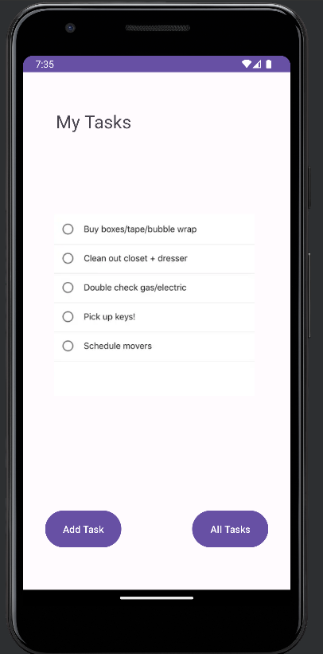
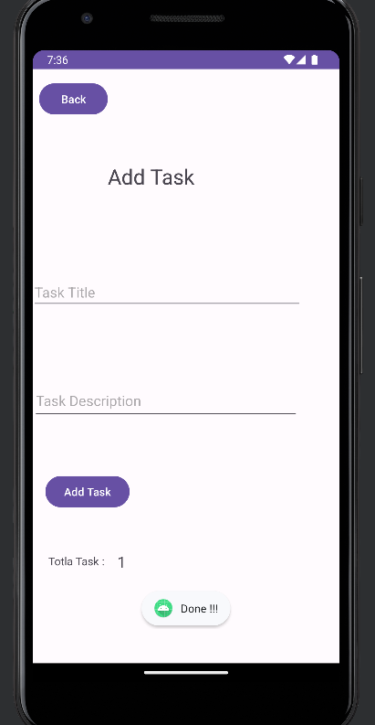
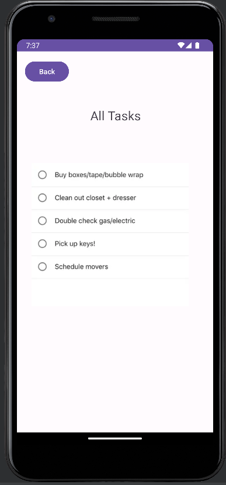

## For next Lab (Lab 27)

After editing the code, I have made the following changes:

### MainActivity

In the `MainActivity` class, I've updated the code to allow users to click on task buttons (Task 1 and Task 2) and navigate to the Task Detail page with the respective task names and settings page to enter his username and save it.

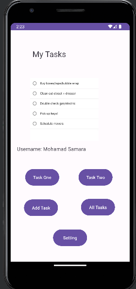

### Settings

To access settings, click on the "Settings" button. In the settings page, you can enter and save your username. This username will be used in various parts of the app.

### SettingActivity

In the `SettingActivity` class, I've added the ability for users to enter and save their username. The username is stored in shared preferences and can be accessed throughout the app.

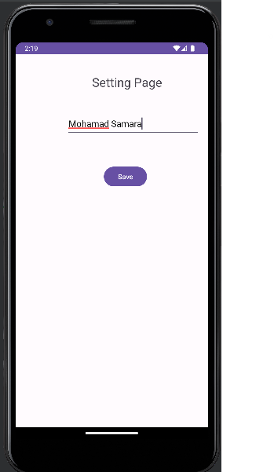

### TaskDetailActivity

The `TaskDetailActivity` class remains unchanged and is responsible for displaying task details based on the selected task.

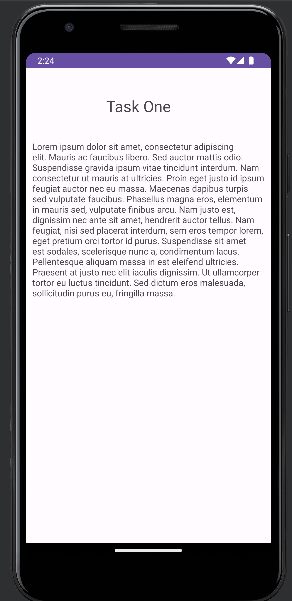
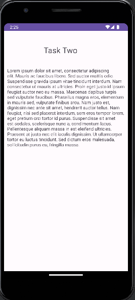

## For next Lab (Lab 28)

Here are the key changes and updates:

### MainActivity

1. Added a `RecyclerView` to the main page of the app to display a list of tasks in a more organized manner. Users can now see their tasks in a scrollable list.

2. Created a `TaskListRecyclerViewAdapter` to manage the data items in the `RecyclerView`. This adapter is responsible for binding task data to individual items in the list.

3. Populated the `RecyclerView` with sample task data, including task titles, bodies, and states (NEW, ASSIGNED, IN_PROGRESS, COMPLETE).

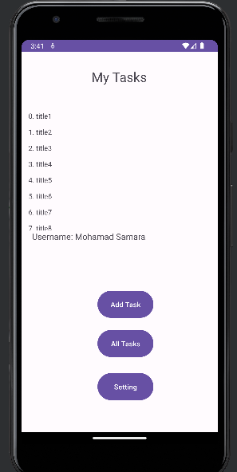

### TaskDetailActivity

1. Modified the `TaskDetailActivity` to correctly handle the display of task details. Users can now click on a task in the list, and the app will navigate to the `TaskDetailActivity` with the selected task's name, body, and state displayed.

2. Updated the code to correctly handle the task's state, ensuring that the task's state is displayed as a user-friendly string (e.g., "NEW" instead of "State.NEW").

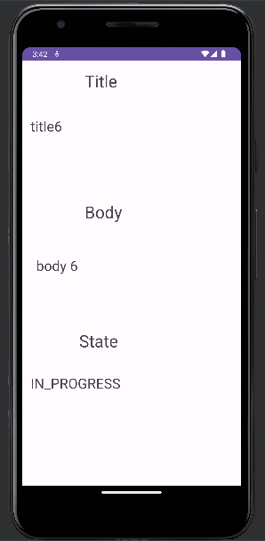

### User Interface

1. Improved the user interface by displaying a more organized list of tasks on the main page using the `RecyclerView`.

## For next Lab (Lab 29)

### Adding Tasks to the Room Database

1. **Database Integration:** I've integrated a Room database to store tasks. The "Add Task" page has been updated to allow users to add new tasks, and these tasks are now saved to the Room database.

2. **Task Class Updates:** I've made updates to the `Tasks` class to represent a table in the database, allowing for seamless interaction with the Room database.

### Displaying Tasks in the RecyclerView

1. **Data Fetching:** I've enhanced the home page by fetching tasks from the database and displaying them in a scrollable list using a `RecyclerView`. This provides users with an organized view of all their tasks.

2. **Task List RecyclerView Adapter:** I've introduced the `TaskListRecyclerViewAdapter` to manage the data items in the `RecyclerView`. This adapter is responsible for binding task data to individual items in the list.

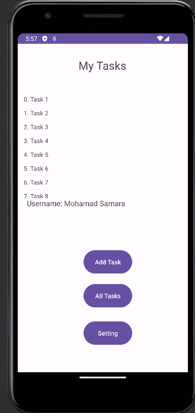

### Task Detail Page

1. **Task Detail Display:** The `TaskDetailActivity` now correctly displays task details based on the selected task. Users can click on a task in the list, and the app navigates to the `TaskDetailActivity` with the selected task's name, body, and state displayed.

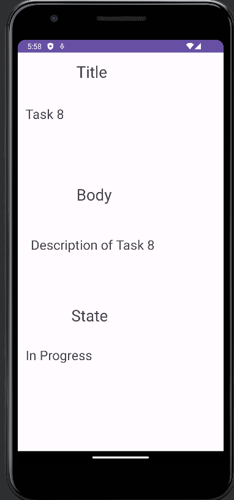

## For next Lab (Lab 31)

1. **Ensured espresso tests are functional include :**
   1. assert that important UI elements are displayed on the page
   2. tap on a task, and assert that the resulting activity displays the name of that task
   3. edit the user’s username, and assert that it says the correct thing on the homepage

2. **Refactored The Code Preparing for the next lab (Remove the Room)**

3. **Added New layout to Activity Like (LinearLayout, TableLayout) To be more Friendly**

Picture For Tests Result : 

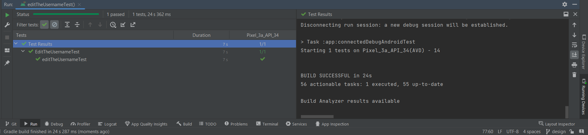

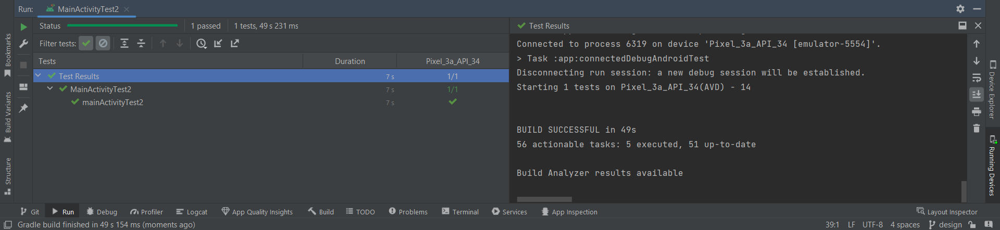

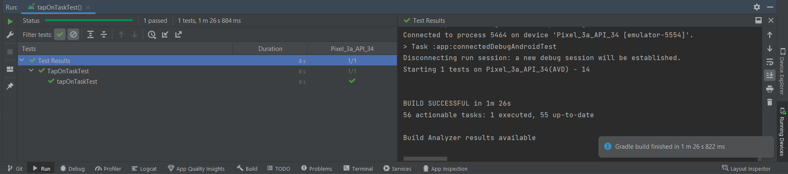

## For next Lab (Lab 32)

1. Updated all references to the Task data to instead use AWS Amplify to access data in DynamoDB instead of in Room.
2. Refactored Main Activity
3. Modified Add Task form to save the data entered in as a Task to DynamoDB.

## For next Lab (Lab 33)

**Create a second entity for a team, which has a name and a list of tasks**

1. Updated tasks to be owned by teams.
2. Three default teams have been made; Mohamad Samara, Team Name 2, and Team Name 3.
3. Spinner used to select a team when creating a task was added.
4. Added ability to allow users to choose a team, and filter the tasks on the homepage corresponding to the chosen team.

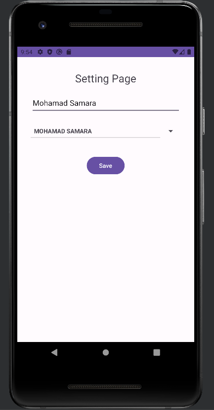
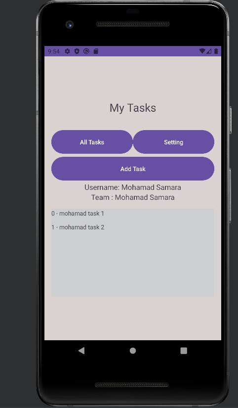
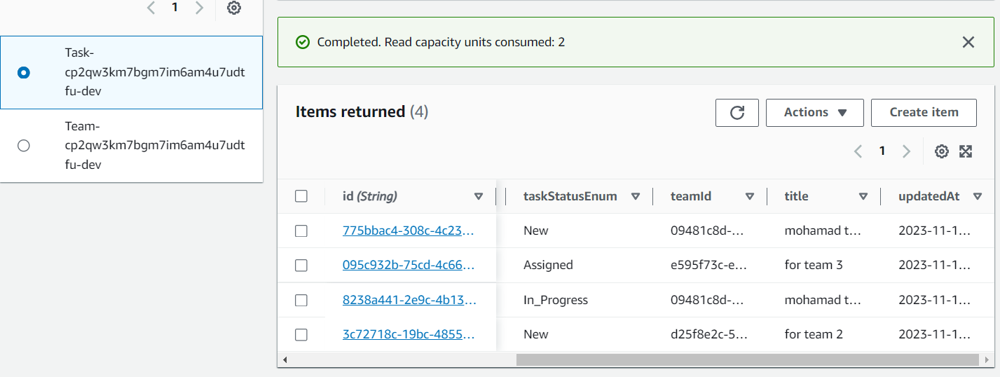

## For next Lab (Lab 34)

**I performed the following operations: deletion and modification**

1. let's start with add new task : 

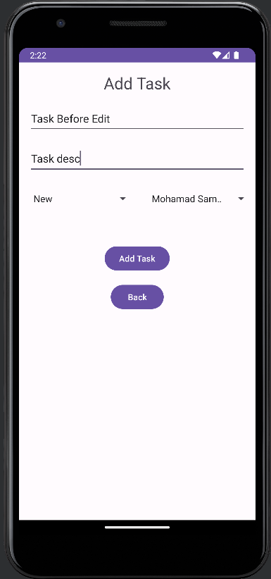
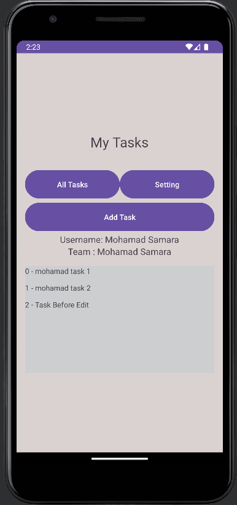

2. Tap on this task and edit it

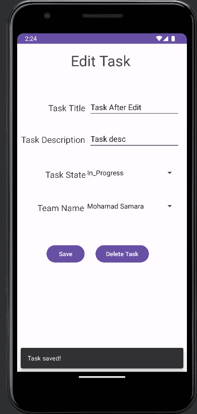
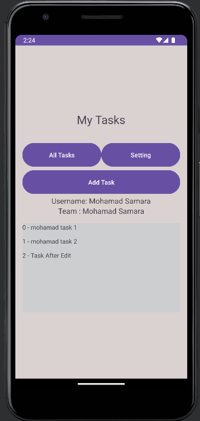
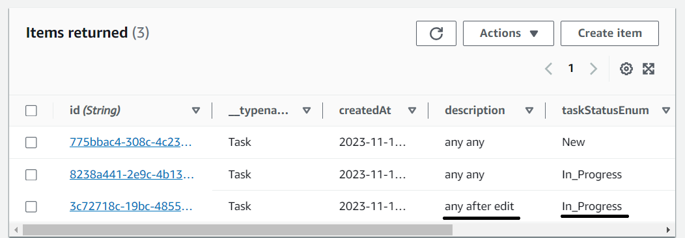

3. Tap on it again and delete it

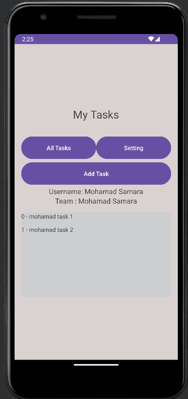

## For next Lab (Lab 36)

**Cognito has been added to the Amplify setup. A user login and signup flow has been integrated into th app. Once the user has successfully logged in, their username is displayed at the top of the homepage**
**Users can logout of the application**

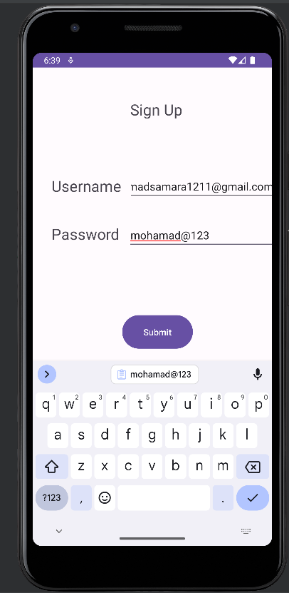
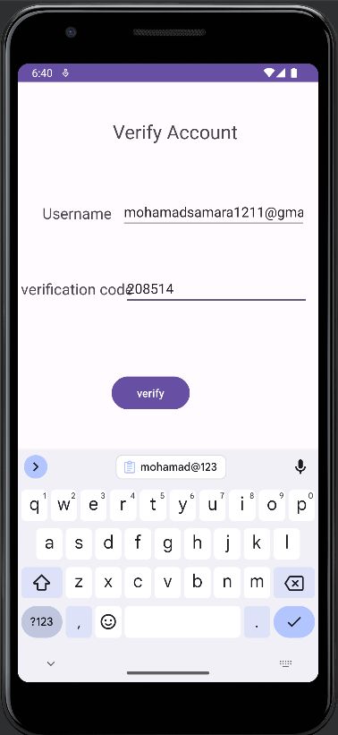
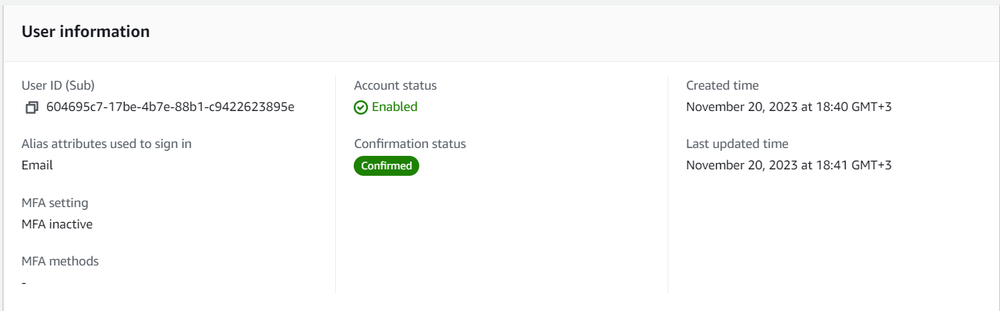
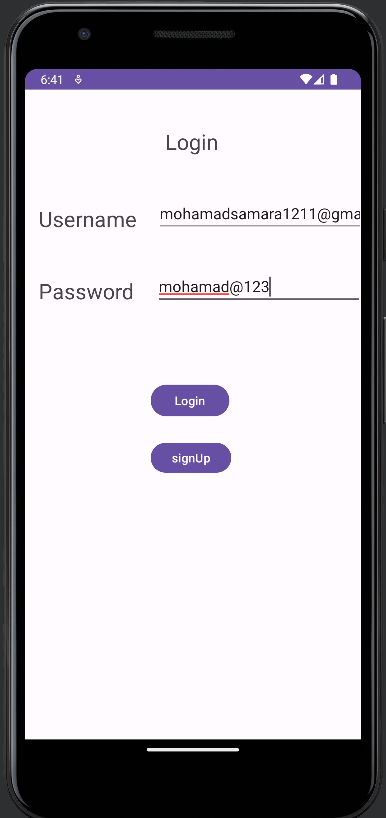
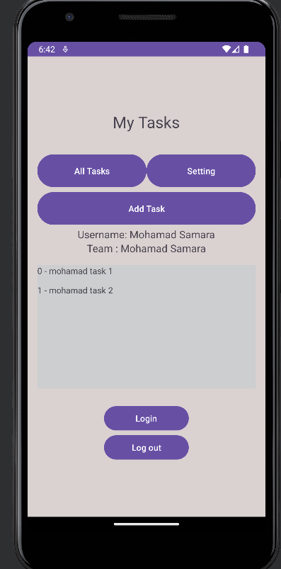

